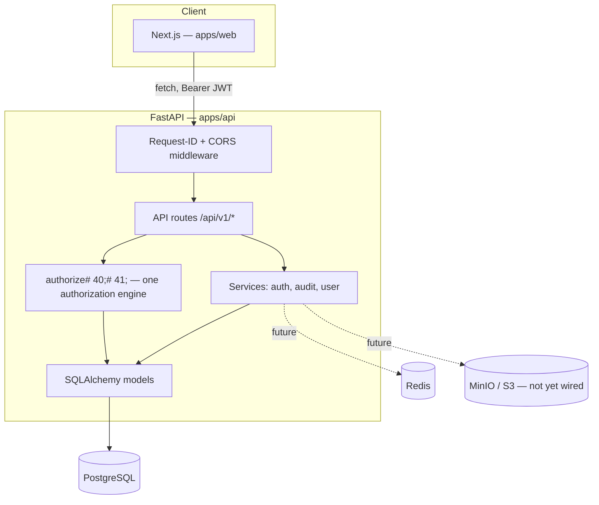
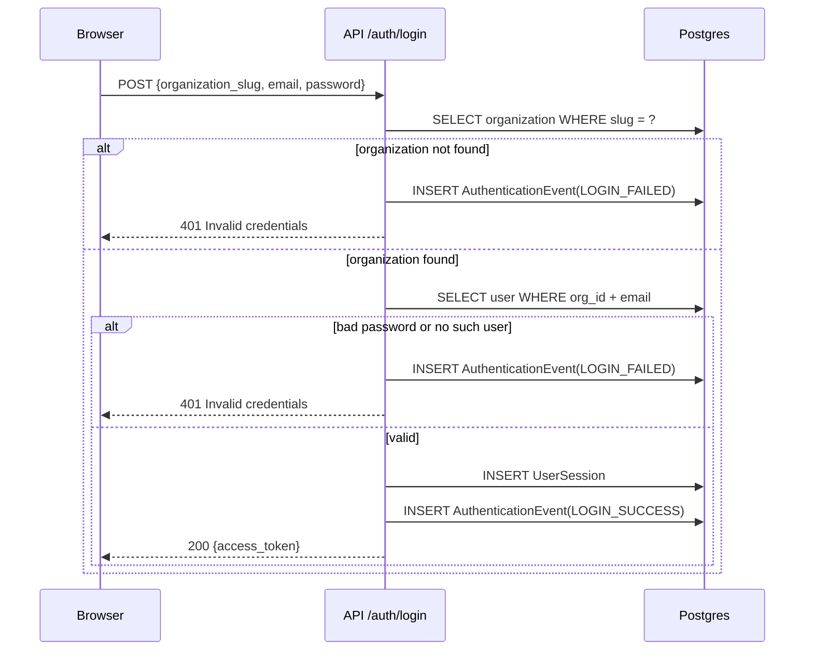
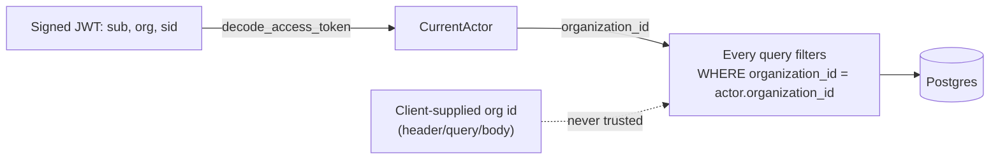
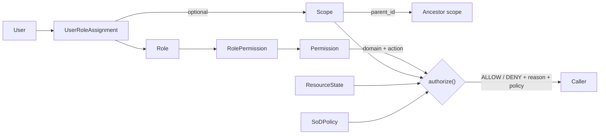

# RAISA Synapse — Layer 1 Foundation

This consolidates what the spec's §62 asked for as eleven separate
files (`AUTHENTICATION.md`, `MULTI_TENANCY.md`, `RBAC_SCOPE_SOD.md`,
etc.) into one document — the material is small enough per-topic that
eleven files would mostly be headers. Split it apart once any one
section outgrows a page.

## Status against the spec

### Implemented and test-verified

| Area | What exists |
|---|---|
| Repo/env foundation | `apps/api`, `apps/web`, Docker Compose (Postgres, Redis, MinIO, api, web), `.env.example` |
| Database foundation | SQLAlchemy models, Alembic migrations, UUID PKs, timestamps, `created_by`/`updated_by`, soft-delete mixin |
| Multi-tenancy | `organization_id` on every tenant-owned table; tenant resolved **only** from the signed JWT, never a client-supplied field |
| Authentication | Login/logout, bcrypt hashing, JWT access tokens, `UserSession`, `AuthenticationEvent` logged on every attempt |
| RBAC + Scope + SoD | `Role` → `Permission` → `Scope` (hierarchical, via `parent_id`) → `UserRoleAssignment`; `SoDPolicy` data model + enforcement for the direct owner-conflict case |
| Authorization engine | One `authorize()` function (`app/services/authorization_service.py`) — every route depends on it via `require_permission()`; deny-by-default |
| Resource state | Generic `ResourceState` enum; `authorize()` blocks mutating actions on `APPROVED`/`EFFECTIVE`/`SUPERSEDED`/`ARCHIVED` regardless of role |
| External consultant access | `valid_from`/`valid_until` on both `User` and `UserRoleAssignment`; `authorize()` denies outside that window |
| Audit | Append-only `AuditEvent`; `/api/v1/audit` is hard-filtered to the caller's own tenant regardless of role |
| Document storage foundation | `Document` / `DocumentVersion` models with checksum, status, version — **no upload/download endpoint or MinIO wiring yet** (see Known limitations) |
| Standards registry foundation | `RegulatoryStandard` / `StandardVersion` / `RegionalImplementation`, seeded with the eight sources spec §57 names |
| Configuration / feature flags | Generic key-value `Configuration`; `FeatureFlag` + per-org `FeatureFlagOverride`, seeded with the six flags spec §31 names (all off except `genx_theme`) |
| Theme system | Both themes implemented as CSS-variable sets (`app/globals.css`), switched via `[data-theme]`; `ThemeSwitcher` component; **not yet persisted to the User row** (see Known limitations) |
| App shell | `/login`, `/dashboard` with top nav (identity / tabs / actions), placeholder zones for Action Center / Global Intelligence / RAISA Assistant |
| API foundation | `/api/v1/{health,auth,organizations,users,roles,permissions,access,audit}`, standard error model, request-ID logging middleware, CORS |
| Testing | 17 pytest tests, all passing — see "What the tests prove" below |

### Explicitly deferred (not started)

- Validation-rule registry, file-format registry, transmission-rule registry (spec §34-37) still store no rule content — the standards registry stores source *metadata* only. (CTD heading registry is now populated — see `docs/LAYER_2_DOSSIER_CTD.md`.)
- Object storage wiring (actual MinIO/S3 upload-download, signed URLs) and document API routes
- Notification triggers (the `Notification` model exists; nothing writes to it yet)
- Shared component library (`Button`, `DataTable`, `Modal`, etc. — spec §41); the current UI is hand-styled Tailwind
- User-management UI, full Access Preview UI, Sessions/Authentication-Events UI (the APIs exist; only `/dashboard` has a UI so far)
- Observability (metrics/tracing hooks), CI/CD pipeline
- OAuth/OIDC/SAML, MFA (extension points exist in the data model; nothing wired)
- E-signature workflow (data model only, per spec §29's own scope)

## Deviations from the spec's suggested layout

Spec §6 suggests `/packages`, `/modules`, `/infrastructure` as
top-level, separately-versioned areas. Layer 1 keeps them as empty,
documented placeholders and instead implements the same domain
separation (identity, tenancy, authorization, audit, documents,
standards, configuration — spec §60) as sub-packages under
`apps/api/app/{models,services,api}/`. Reasoning: with exactly one
frontend and one backend service, splitting into independently
versioned packages adds import indirection with no consumer to justify
it yet. Revisit this the moment a second service (a worker, a second
API) needs to import one of these domains without importing all of
`apps/api`.

## Architecture

### Authentication flow

### Tenant isolation

### RBAC + Scope

## What the tests prove

`apps/api/tests/` — run with `scripts/run_tests.sh` or see the README.

- **`test_tenant_isolation.py`** — the spec §55/§66 mandatory test:
  Tenant A cannot list Tenant B's users, cannot fetch one by ID even
  knowing its UUID (404, not 403 — never confirm the ID exists
  elsewhere), and cannot log in against Tenant B even with an identical
  email+password pair that happens to also exist there.
- **`test_authorization.py`** — a user without `APPROVE` is denied
  (RBAC); the actual *shipped* `seed.py` System Administrator role
  cannot view documents (spec §16) while still legitimately
  administering users; editing an `APPROVED` resource is blocked
  regardless of role (spec §21); an author cannot also approve their
  own resource (SoD); expired consultant access and suspended users are
  denied even with an otherwise-valid role.
- **`test_auth.py`** — login success/failure both write an
  `AuthenticationEvent`; failure messages never distinguish "no such
  user" from "wrong password"; `/me` requires auth; logout revokes the
  session and is logged.

## Known limitations

- Theme preference is stored in `localStorage`, not yet round-tripped
  through `PATCH /api/v1/users/{id}` to the `User.theme_preference`
  column that already exists for it.
- No object storage wiring — `Document`/`DocumentVersion` have no
  upload endpoint yet.
- `packages/`/`modules/` are intentionally empty (see Deviations,
  above).
- Frontend has not been `npm install`-verified in the sandbox this was
  built in (the backend was — see Status); the API was.

## Running it

See the root `README.md`.
